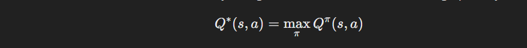

## Policies and Value Functions in Reinforcement Learning

In an MDP, policies and value functions are fundamental concepts that guide an agent's behavior and measure the quality of states and actions.

1. What is a Policy ($\pi$)?

A policy defines the agent's behaviour: it is a **mapping from states to actions**. The policy determines what action the agent will take in each state.

**Types of Policies:**

- Deterministic Policy:
    - A deterministic policy maps a state to a specific action:
    
    - Example: If the agent is in a state s, it always chooses action a.

- Stochastic Policy:
    - A stochastic policy defines the probabilities of taking each action in a given state:
    
    - Example: If the agent is in state s, it chooses action a with a certain probability.

**Policy Goal:**
The goal in RL is to find an **optimal policy ($\pi$*)** that maximizes the expected cumulatice reward.

2. What is a Value function?
A value function **estimates the expected return (cumulative reward)** starting from a state or a state-action pair, given that the agent follows a specific policy.

**Types of Value Functions:**

- State-Value Function $(V^\pi(s))$:
    - The value of a state s under a policy $\pi$ is the expected cumulative reward the agent can achieve starting from s and following $\pi$:
    
    - Where Gt is the return:
    

    **Interpretation:**
    $(V^\pi(s))$ tells us how "good" it is to be in state s if the agent follows policy $\pi$.

- Action-Value Function $(Q^\pi(s, a))$:
    - The value of taking action a in state s under the policy $\pi$ is the expected cumulative reward.
    

    **Interpretation:**
    $(Q^\pi(s, a))$ tells us how "good" it is to take action a in state s and follow the policy $\pi$.

3. Relationship between Policies and Value Functions

The value function depends on the policy:
- For a given policy $\pi$, $V^\pi(s)$ and $Q^\pi(s, a)$ represents the performance of the policy.
- When we improve the policy, the value functions also improve.

**Optimal Value Functions:**
- Optimal State-Value Function $(V^*(s))$:
    - The maximum value achievable in state s, over all the possible policies:
    

- Optimal Action-Value Function $(Q^*(s, a))$:
    - The maximum value achievable by taking action a in state a and then acting optimally:
    

**Finding the Optimal Policy:**
- The optimal policy $\pi^*$ chooses actions that maximize the optimal value functions:
